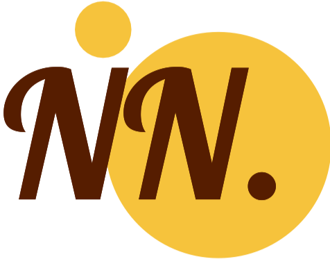

<a name="readme-top"></a>

<section align="center">

[![Contributors][contributors-shield]][contributors-url]
[![Forks][forks-shield]][forks-url]
[![Stargazers][stars-shield]][stars-url]
[![Issues][issues-shield]][issues-url]

</section>

<section align="center">

<p></p>

[![LinkedIn][linkedin-shield]][linkedin-url]

</section>

<!-- PROJECT LOGO -->
<br />
<div align="center">
  <a href="https://github.com/lulrai/port_v1/blob/main/README.md">
    
  </a>

  <h3 align="center">Porfolio Website</h3>

  <p align="center">
    A portfolio website containing all the information about me and my experiences.
    <br />
    <a href="https://github.com/lulrai/port_v1/issues">Report Bug</a>
  </p>
</div>

<!-- TABLE OF CONTENTS -->
<details>
  <summary>Table of Contents</summary>
  <ol>
    <li>
      <a href="#about-the-project">About The Project</a>
      <ul>
        <li><a href="#built-with">Built With</a></li>
      </ul>
    </li>
    <li><a href="#usage">Usage</a></li>
    <li><a href="#roadmap">Roadmap</a></li>
    <li><a href="#contact">Contact</a></li>
    <li><a href="#acknowledgments">Acknowledgments</a></li>
  </ol>
</details>

<!-- ABOUT THE PROJECT -->

## About The Project

<section align="center">

[![Application ScreenShot][product-screenshot]](https://lotro.com)

</section>

Just a simple website with various aspects. Some of the features are as follows:

- Profile: My personal information and nice image of myself.
- Projects: All the projects pulled directly from GitHub using the GitHub API.

- Experience: Parses the `resume.pdf` file present in the `public` directory for work experience. The resume is generated using the TeX file present in `resume_builder` directory. If you use the same format, the parsing should be successful.
- Contact: How to contact me!
- About: More information about me and what I do.
- Resume: Download or view my resume in PDF format.
- Obviously, light and dark mode possibility.

> _Note: If you want to use this project, add a `.env` file in your working directory and add a key `VITE_GH_API_KEY` with your GitHub API key as the value for it to work._

<p align="right">(<a href="#readme-top">back to top</a>)</p>

### Built With

The project was built with `ReactJS`. All the dependencies are listed below:

- [![React][react.js]][react-url]
- [![Vite][vite]][vite-url]
- [![TypeScript][typescript]][typescript-url]
- [![LaTeX][latex]][latex-url]
- [![CSS3][css3]][css3-url]
- [![HTML5][html5]][html5-url]
- [![Yarn][yarn]][yarn-url]
- [![Firebase][firebase]][firebase-url]
- [![GitHub Actions][action]][action-url]

<p align="right">(<a href="#readme-top">back to top</a>)</p>

## Usage

This is just version 1 of the website so still a work in progress but to run this, the steps are as follows:

#### Setup

- Install `yarn` and `npm`.
- Install `firebase` and `vite`.
- Clone the repository, obviously.

#### Running

- Open the folder in an editor like **VSCode**.
- Install all dependencies required using the following command:

```bash
yarn
```

- (Optional) Login to firebase and setup the project, follow the steps given by the command:

```bash
firebase login
```

- Finally, run the command to host the server:

```bash
yarn dev
```

_Be Aware: There will be various changes and updates will be pushed very often._

<p align="right">(<a href="#readme-top">back to top</a>)</p>

## Roadmap

- [x] Basic website
- [x] PDF compiling using [xu-cheng/latex-action](https://github.com/xu-cheng/latex-action)
- [x] PDF parsing using [pdf.js](https://mozilla.github.io/pdf.js/)
- [x] Load repositories using GitHub API
- [ ] Fix UI for some mobile medias
- [ ] Fix UI for no-animation medias
- [ ] Maybe revamp the website somehow?

See the [open issues](https://github.com/lulrai/port_v1/issues) for a full list of known issues.

<p align="right">(<a href="#readme-top">back to top</a>)</p>

<!-- CONTACT -->

## Contact

Project Link: [https://github.com/lulrai/port_v1](https://github.com/lulrai/port_v1)

<p align="right">(<a href="#readme-top">back to top</a>)</p>

<!-- ACKNOWLEDGMENTS -->

## Acknowledgments

- [Choose an Open Source License](https://choosealicense.com)
- [Img Shields](https://shields.io)
- [GitHub Pages](https://pages.github.com)

<p align="right">(<a href="#readme-top">back to top</a>)</p>

<!-- MARKDOWN LINKS & IMAGES -->
<!-- https://www.markdownguide.org/basic-syntax/#reference-style-links -->

[contributors-shield]: https://img.shields.io/github/contributors/lulrai/port_v1.svg?style=for-the-badge
[contributors-url]: https://github.com/lulrai/port_v1/graphs/contributors
[forks-shield]: https://img.shields.io/github/forks/lulrai/port_v1.svg?style=for-the-badge
[forks-url]: https://github.com/lulrai/port_v1/network/members
[stars-shield]: https://img.shields.io/github/stars/lulrai/port_v1.svg?style=for-the-badge
[stars-url]: https://github.com/lulrai/port_v1/stargazers
[issues-shield]: https://img.shields.io/github/issues/lulrai/port_v1.svg?style=for-the-badge
[issues-url]: https://github.com/lulrai/port_v1/issues
[linkedin-shield]: https://img.shields.io/badge/-LinkedIn-blue?style=for-the-badge&logo=Linkedin&logoColor=white&link=https://www.linkedin.com/in/nneupane2/
[linkedin-url]: https://www.linkedin.com/in/nneupane2/
[product-screenshot]: public/product_sc.png
[conda]: https://img.shields.io/badge/Anaconda-%2344A833.svg?style=for-the-badge&logo=anaconda&logoColor=white
[conda-url]: https://docs.conda.io/en/latest/
[react.js]: https://img.shields.io/badge/React-20232A?style=for-the-badge&logo=react&logoColor=61DAFB
[react-url]: https://reactjs.org/
[vite]: https://img.shields.io/static/v1?style=for-the-badge&message=Vite&color=646CFF&logo=Vite&logoColor=FFFFFF&label=
[vite-url]: https://vitejs.dev
[typescript]: https://img.shields.io/static/v1?style=for-the-badge&message=TypeScript&color=3178C6&logo=TypeScript&logoColor=FFFFFF&label=
[typescript-url]: https://www.typescriptlang.org
[latex]: https://img.shields.io/static/v1?style=for-the-badge&message=LaTeX&color=008080&logo=LaTeX&logoColor=FFFFFF&label=
[latex-url]: https://www.latex-project.org
[css3]: https://img.shields.io/static/v1?style=for-the-badge&message=CSS3&color=1572B6&logo=CSS3&logoColor=FFFFFF&label=
[css3-url]: https://www.w3schools.com/css/css_website_layout.asp
[html5]: https://img.shields.io/static/v1?style=for-the-badge&message=HTML5&color=E34F26&logo=HTML5&logoColor=FFFFFF&label=
[html5-url]: https://developer.mozilla.org/en-US/docs/Glossary/HTML5
[yarn]: https://img.shields.io/static/v1?style=for-the-badge&message=Yarn&color=2C8EBB&logo=Yarn&logoColor=FFFFFF&label=
[yarn-url]: https://yarnpkg.com
[firebase]: https://img.shields.io/static/v1?style=for-the-badge&message=Firebase&color=222222&logo=Firebase&logoColor=FFCA28&label=
[firebase-url]: https://firebase.google.com
[action]: https://img.shields.io/static/v1?style=for-the-badge&message=GitHub+Actions&color=2088FF&logo=GitHub+Actions&logoColor=FFFFFF&label=
[action-url]: https://github.com/features/actions
